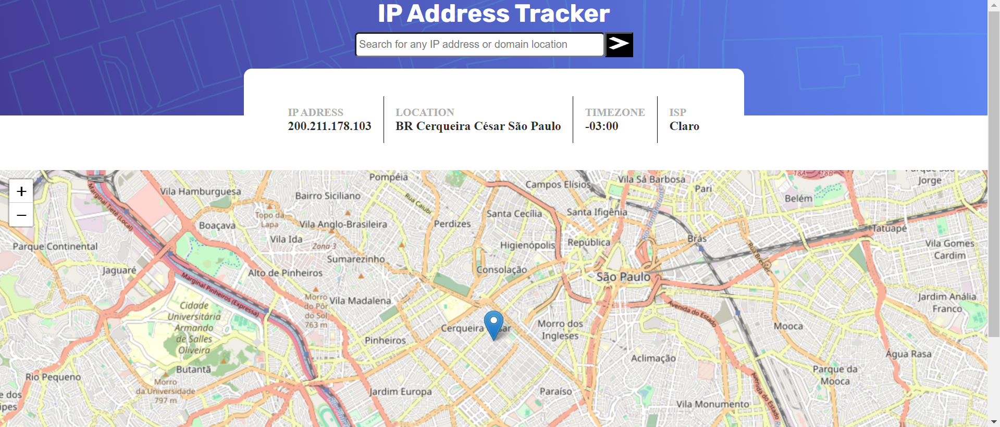

# Frontend Mentor - IP address tracker solution

Essa é minha solução para o desafio [IP address tracker challenge on Frontend Mentor](https://www.frontendmentor.io/challenges/ip-address-tracker-I8-0yYAH0).

## Indice

-- [Visão Geral](#visão-geral)

- [Frontend Mentor - IP address tracker solution](#frontend-mentor---ip-address-tracker-solution)
  - [Indice](#indice)
  - [Visão geral](#visão-geral)
    - [O desafio](#o-desafio)
    - [Captura de Tela](#captura-de-tela)
    - [Links](#links)
    - [Tecnologias Utilizadas](#tecnologias-utilizadas)
    - [O que eu aprendi neste projeto](#o-que-eu-aprendi-neste-projeto)
    - [Recursos Úteis](#recursos-úteis)
  - [Autor](#autor)

## Visão geral

O objetivo principal é usar a API geoipfy e a biblioteca leafletjs para criar um mapa interativo que busque a localização baseada no IP

### O desafio

Os usuários devem ser capazes de:

- Visualizar o layout ideal para cada página, dependendo do tamanho da tela do dispositivo.
- Ver estados de hover para todos os elementos interativos na página.
- Ver o próprio endereço IP no mapa ao carregar a página inicial.
- Pesquisar qualquer endereço IP ou domínio e ver as informações e localização principais.

### Captura de Tela

()

### Links

- Link da solução: [Frontend Mentor](https://www.frontendmentor.io/solutions/ip-address-CBQZm8t1QP)
- Link do projeto hospeado: [Vercel.app](https://ipatracker.vercel.app/)

### Tecnologias Utilizadas

- HTML5 Semântico
- Propriedades CSS Personalizadas
- Flexbox
- Geoipfy API
- Biblioteca Leafletjs
- Design responsivo

### O que eu aprendi neste projeto

Durante o desenvolvimento deste projeto, aprendi várias técnicas valiosas, incluindo:

- **Integração com APIs**: Aprender a trabalhar com APIs para buscar e exibir dados dinâmicos.
- **Manipulação de Mapas**: Utilizar bibliotecas como Leaflet para exibir e manipular mapas interativos.
- **Responsividade**: Implementar um design responsivo para garantir uma boa experiência de usuário em diferentes dispositivos.

### Recursos Úteis

- [Documentação do Leaflet](https://leafletjs.com/examples/quick-start/) - Uma excelente fonte para entender e usar a biblioteca Leaflet para mapas.
- [Documentação do Geoipfy](https://geo.ipify.org/docs) - Explicação detalhada de como a api trabalha e quais são os dados que poder ser consultados

## Autor

- Website - [Portfólio](https://jonathan-silva.vercel.app/)
- Frontend Mentor - [@JohnSilva98](https://www.frontendmentor.io/profile/JohnSilva98)
